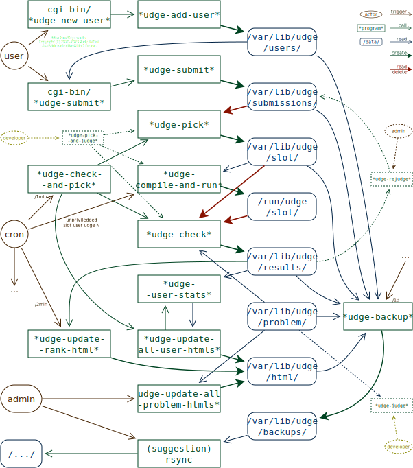

Udge
====

Udge is an online judge for programming problems.

Using Udge you can host programming problems in an HTTP site.
Users can submit solution programs which are automatically scored.
Scores are then reported in each user's page.

Uses:

* hosting programming contests;
* hosting programming problems for students by teachers, lecturers or professors;
* hosting an online judge.

The usual goal of problems hosted on Udge is to create a command line program
that reads data from standard input and produces results on standard output.

Udge is not a collection of programming problems
but rather the software used to host them.
You should create your own problems:
write the problem description in markdown
and create input and output cases
following [Udge's Problem directory] format.
Udge comes with seven example problems illustrating this.

[Udge's Problem directory]: #problem-directory-----varlibudgeproblem

Features:

* multiple sets of input/output files per problem -- graded scores;
* problem description in markdown;
* support for "library" solutions
  where one has to implement a specific function;
* a rank with a few selectable formats;
* [a simple plaintext file database], no need to setup an SQL server and database;
* support for solutions in:
	- [C]
	- [C++]
	- [C#]
	- [Haskell]
	- [Java]
	- [JavaScript]
	- [Lua]
	- [Python]
	- [Ruby]
	- [Racket]
	- [Scheme]
	- [R]

[a simple plaintext file database]: #a-file-based-database

Udge is implemented in [Bash] and works on [Linux] systems with [Nginx].
It uses static HTML pages where possible.
These pages are updated by minutely cron jobs.
The only two dynamic pages are for submission and user creation.

Udge is free/libre software.
It is available under the GPLv2 license
unless otherwise stated in specific files.
--- Copyright (C) 2015-2023  Rudy Matela ---
This program is distributed in the hope that it will be useful,
but __without any warranty__; without even the implied warranty of
__merchantability__ or __fitness for a particular purpose__.
See the GNU General Public License for more details.

Udge is already functional and usable but it is a _work in progress_.
Keep in mind that Udge runs submitted programs so use with care.
There is submission sandboxing if users and cron jobs are set up correctly
but this feature can still be improved.
Keep an eye on the logs to see what is being submitted and run.

Udge is currently used on [Computer Science by Example](https://cscx.org/),
a collection of programming exercises.

Dependencies
------------

To install and run Udge, you will need:

* [Make]
* [Bash]
* [Python]
* [nginx]
* [fcgiwrap]
* [cronie] or any other [cron]
* [cracklib]   --- for checking password strength
* [diffutils]  --- for `diff` and whatnot
* [discount]   --- for `markdown`
* [fakechroot] --- for sandboxing

You probably already have the following installed,
but it does not hurt to double-check:

* [coreutils]  --- for `timeout` and whatnot
* [grep]
* [psmisc]     --- for `killall` and whatnot
* [time]       --- for measuring runtime with `/usr/bin/time`
* [util-linux] --- for sandboxing with `unshare`, `kill`, etc.

These are the optional dependencies:

* [clitest]    --- for testing Udge itself
* [tidy]       --- for testing Udge itself
* [GCC]        --- for [C] and [C++] submission support
* [GHC]        --- for [Haskell] submission support
* [Java]       --- for [Java] submission support
* [Lua]        --- for [Lua] submission support
* [Mono]       --- for [C#] submission support
* [nodejs]     --- for [JavaScript] submission support
* [Ruby]       --- for [Ruby] submission support
* [Racket]     --- for [Racket] submission support
* [Guile]      --- for [Scheme] submission support
* [R]          --- for [R] submission support

On [Ubuntu] or [Debian], you can install all dependencies with:

	apt-get install make bash python3 python-is-python3 nginx fcgiwrap cron cracklib-runtime diffutils discount fakechroot procmail clitest tidy gcc ghc openjdk-11-jdk lua mono-devel nodejs ruby guile-3.0 guile-3.0-dev racket r-base-core

On [Arch Linux], with the exception of [clitest], you can install all dependencies with:

	pacman -S make bash python nginx fcgiwrap cronie cracklib diffutils time discount fakechroot procmail tidy gcc ghc jdk11-openjdk lua mono nodejs ruby guile racket-minimal r

[dependencies]: #dependencies

Installing and Configuring
--------------------------

TODO: provide packages for [Arch Linux] and [Ubuntu].

First make sure you have all the [dependencies] installed.  Then:

1. run `make install` as `root`:

		$ sudo make install

	Depending on your Linux distribution, you may need to set `HTTPD_USER`:

		$ sudo make install HTTPD_USER=<user>

	The Makefile should be able to figure these automatically on Arch Linux
	(tested) and on Debian/Ubuntu variants (tested).

2. (required for Ubuntu/Debian variants, recommended for other systems)
	add the following to `/etc/fstab`:

		tmpfs /run/udge   tmpfs rw,nosuid,nodev,relatime,size=12288k,mode=755,uid=udge,gid=udge   0 0
		tmpfs /run/udge/1 tmpfs rw,nosuid,nodev,relatime,size=12288k,mode=775,uid=udge,gid=udge-1 0 0
		tmpfs /run/udge/2 tmpfs rw,nosuid,nodev,relatime,size=12288k,mode=775,uid=udge,gid=udge-2 0 0
		tmpfs /run/udge/3 tmpfs rw,nosuid,nodev,relatime,size=12288k,mode=775,uid=udge,gid=udge-3 0 0
		tmpfs /run/udge/4 tmpfs rw,nosuid,nodev,relatime,size=12288k,mode=775,uid=udge,gid=udge-4 0 0
		tmpfs /run/udge/5 tmpfs rw,nosuid,nodev,relatime,size=12288k,mode=775,uid=udge,gid=udge-5 0 0
		tmpfs /run/udge/6 tmpfs rw,nosuid,nodev,relatime,size=12288k,mode=775,uid=udge,gid=udge-6 0 0

	The above will isolate the file system that Udge uses for each slot
	making sure that a submission that accidentally fills up the disk
	is not able to disrupt other submissions that are running at the same time.
	Here we use a modest limit of 12M per slot since tmpfss reside in memory.

	If you are running Ubuntu or another system
	that has `/run` mounted as a filesystem with noexec restrictions,
	at least the first line with `/run/udge` is required.
	Though if you decide to use the first line alone,
	better use a bigger size such as `48944k`.

3. (optional)
	add your problems to `/var/lib/udge/problem`
	and update `index.md` accordingly
	otherwise you will be using the default example problems.
	This can be done at a later point.

	After setting them up, make sure you run:

		chmod o-r /var/lib/udge/problem/{*,*/*}/out

	The above will prevent attempted solutions
	to read directly from solution files.
	(cf. `examples/sandbox/sol-searcher.c`)

4. generate static HTML files:

		sudo -u udge udge-update-all-problem-htmls
		sudo -u udge udge-update-rank-html

	You will have to re-run `udge-update-all-problem-htmls` every time you add
	or edit a problem description so HTML files are updated.

5. Add the following entry to `/etc/hosts`.

		127.0.0.1 udge udge.example.com

	If you have another domain name you would like to use,
		replace it here instead.
	If you already have a public DNS entry pointing to your server
		you may skip this step.

6. (optional) edit the domain name on Udge's Nginx config
	located on `/etc/nginx/sites-available/udge`.

7. start the Nginx server if you haven't done so with either:

	- `systemctl start nginx`; or
	- `service nginx start`; or
	- `/etc/inid.d/nginx start`; or
	- ...

	which will depend on your Linux distribution.

8. start and enable fcgiwrap and fcgiwrap.socket:

	- `systemctl start fcgiwrap.socket`
	- `systemctl start fcgiwrap`
	- `systemctl enable fcgiwrap.socket`
	- `systemctl enable fcgiwrap`

9. enable Udge on Nginx and reload the configuration:

		make enable-nginx-udge-site

10. test that everything works
	by typing `udge.example.com` (or your selected domain of steps 5 and 6)
	in your browser's address bar.
	If this does not work try also `http://udge/` or `http://udge.example.com/`.

	You should see the problem index and the menu at the top and bottom.

11. (optional) install and configure a certificate with certbot

		apt install certbot python3-certbot-nginx  # or equivalent
		sudo certbot --nginx -d udge.example.com -d www.udge.example.com

12. (optional) add an extra `css` file to `/var/lib/udge/problem/extra.css`
    if you would like to configure the appearance of Udge.

Udge can be customized on it's configuration file `/etc/udgerc`.

[Installing and Configuring]: #installing-and-configuring

Pages and Routes
----------------

If the installation is working you should be able to access the following pages,
each accessed by typing `udge/<page>` or `<yourdomain>/<page>`:

* `/`:              the index with the list of problems (`index.md`)
* `/submit`:        submission of solutions
* `/new-user`:      user creation
* `/<problem>`:     a problem description, e.g.:
	- `/hello`
	- `/add`
	- `/hello-world`
* `/u/<user_name>`: user's page with
                    scores for each problem and latest submissions
* `/rank`:          the user rank

Creating a Problem
------------------

To create a problem on Udge:

1. Create a subdirectory to `/var/lib/udge/problem` called:

		/var/lib/udge/problem/<problem-code>

	The problem code should contain only
		digits,
		lowercase English letters and
		dashes (`-`).

2. Create three files in the newly created problem folder:

	* `desc.md`: a markdown file with your problem description

	* `in`: the input file.
		This will be used as the standard input to submitted solutions:

			./submitted-program <in

	* `out`: the reference output file.
		This will be compared to the standard output of submitted solutions:

			./submitted-program <in >run/out
			diff -rud run/out out

		If output matches exactly, the submission will get a score.

		Make sure you `chmod o-r` the `out` file after installing it
		to make sure solution programs are not able to read from it.

3. Link to the newly created problem on the problem index
	by editing the following file:

		/var/lib/udge/problem/index.md

4. Update static HTML files by running:

		sudo -u udge udge-update-all-problem-htmls

5. (testing) Access the newly created problem on:

		http://udge/<problem-code>

6. (testing) Submit a _correct_ solution to the newly created problem
	and make sure it receives a full score.

7. (testing) Submit an _incorrect_ solution to the newly created problem
	and make sure it does not receive a full score.

Please see the `addition` problem for an example of this.

### Multiple input and output pairs

To set up a problem with multiple I/O pairs,
instead of creating just `in` and `sol`,
create several subdirectories `1`, `2`, `3`, ...
Inside each create `in` and `out` files:

* `1/in`
* `1/out`
* `2/in`
* `2/out`
* `3/in`
* `3/out`
* ...

Please see the `add` problem for an example of this.

Development Information
-----------------------

This section contains development information to those interested in forking or
contributing to Udge's development.

### Setting up a Development Environment

This section is intended for people who want to work on Udge development
itself.  If you just want to _use_ Udge to host problems please see the
[Installing and Configuring] section instead.

First make sure you have all the [dependencies] installed.
Make sure you _don't_ have Udge installed by `make install`.
Use `make uninstall-and-purge` if needed.

The following sequence of commands can be used to set up the development
environment.  Run them as your _regular user_.  You should only use `root`
while running those preceded by `sudo`.

	make dev-setup
	sudo make dev-install
	make html
	sudo make start-services
	sudo make enable-nginx-udge-site

You should also add `127.0.0.1 udge` to `/etc/hosts`.

If everything worked correctly,
you should be able to run `make test` successfully.

If you like your development environment
to automatically judge and update pages in the background,
you should also add the contents of `etc/cron.d/udge` to your regular user's
crontab (use `crontab -e`).  You will have to remove references to the `udge`
and `udge-*` but the contents should be otherwise the same.

### Programs and Commands

Here's a complete list of programs provided with Udge:

* `cgi-bin/udge-new-user`: CGI script that handles user creation;
* `cgi-bin/udge-submit`: CGI script that handles submission of solution;
* `udge-add-user`: adds a user creating an entry on `users`.
* `udge-judge`: judges a solution printing results to stdout
* `udge-latest-results`: shows the latest results from a user
* `udge-pick-and-judge`: picks a solution at random from `submissions`,
                         creates a result on `results`.
						 For debug only.
* `udge-check-and-pick`: checks run submissions and picks new ones.
                         To be run from cron at each minute.
* `udge-compile-and-run <slot>`: runs a submission on a specific slot.
								 To be run from cron at each minute.
* `udge-rank`: computes and prints the current user rank
* `udge-sandbox`: runs a program in a sandbox.
	Currently sandboxing has a few limitations:
	forking protection can be improved;
	it does not chroot yet (as the chroot folders are still TBD);
	it is not applied to compilation (but should).
	These should be addressed in the future.
* `udge-submit`: submits a solution to the judge using HTTP
* `udge-update-all-problem-htmls`: updates all problem HTML files
* `udge-update-all-user-htmls`: updates all user HTML files
* `udge-update-rank-html`: updates the rank HTML file
* `udge-update-user-html`: updates a single user HTML file
* `udge-user-stats`: prints the stats for a given user
* `udge-delete-user`: deletes a user
* `udge-passwd`: changes the password of a user
* `udge-rejudge`: queues a result to be rejudged
* `udge-create-submission`: creates a submission in `submissions`.
* `udge-create-run`: creates the `/run/udge` hierarchy.
					 You should actually use `etc/tmpfiles.d/udge.conf`
					 on real installations.
* `udge-backup`: saves a backup of `/var/lib/udge/...`
                 on `/var/lib/udge/backups`.

### A file-based Database

Udge stores information about problems, users, submissions and results
in plain text files:

* `/var/lib/udge/users`:       directory with user information (credentials)
* `/var/lib/udge/problem`:     I/O test cases and markdown files
* `/var/lib/udge/submissions`: submissions that are still to be judged
* `/var/lib/udge/results`:     results of judging submissions
* `/var/lib/udge/html`:        the static HTML pages (problems and users)
* `/var/lib/udge/slot/<slot>`: submission slot
* `/run/udge/<slot>`:          temporary files

This section describes the structure of each of these directories.

Submissions first arrive on the `/submissions` folder
then moved to one of the slots `/slot/<slot>`
and are finally moved into the `/results` folder.

#### User Directory --- `/var/lib/udge/users`

The user directory stores main user information and credentials.

* `bin/udge-add-user` creates entries in this directory.
* `cgi-bin/udge-new-user` uses `bin/udge-add-user` to create entries here.
* `cgi-bin/udge-submit` checks credentials in this directory.

User information is stored in plain files under the `users` directory.
Each user is described as a directory with it's name which should be composed
only of English lowercase letters, dashes (`-`) and underscores (`_`).

Emails, password hashes and salts are stored each in its own file with a single line:

	/var/lib/udge/users/<user>/email
	/var/lib/udge/users/<user>/password
	/var/lib/udge/users/<user>/salt

For example:

	users/janeroe/salt:aSTR1PRypdeUUPeX7NFZYwVWrlXac4MYZHoCUIaq
	users/janeroe/email:janeroe@example.net
	users/janeroe/password:e0b3400da3f9edc96718a1b5d0da315f518e36b820404635998319662828fe44
	users/johndoe/salt:QHFNE6WhJD9VoRGeLljOGwBZz//LTXUfnzJpw1k9
	users/johndoe/email:johndoe@example.com
	users/johndoe/password:edbe9e7dd28ca60a1874c88f036513bcf0bcc4d8b5d1f7d875e4fc37b8059828

User passwords are not stored into the system, just their hashes after salting.
There's a different random salt for each user.

#### Problem Directory --- `/var/lib/udge/problem`

The problem directory contains test scripts, inputs and solutions for each of the problem.

* `bin/udge-judge` reads this directory

Each problem has a directory, `/var/lib/udge/problem/<problem>`.  Inside it:

* `1/in`: test input 1
* `1/out`: reference output 1
* `1/af`: (optional) files to be present in the working directory after the run
* `1/bf`: (optional) files to be present in the working directory before the run
* `1/*.txt`: (optional) additional files to the `bf` folder
* `1/time-limit`: (optional) the time limit in seconds (1 if not present)
* `1/check-out`: (optional) script to check the output file
* `1/check-exit-code`: (optional) script to check the exit code
* `1/check-src`: (optional) script to check the source (e.g.: code-conventions)
* `2/in`: test input 2
* `2/out`: reference output 2
* `2/...`: test set 2
* `3/...`: test set 3
* ...

If there is only one test set, you are allowed to let `in` and `out` reside
plainly without a subdir.

#### Submissions Directory --- `/var/lib/udge/submissions`

The submissions directory contains submissions that are yet to be scored.

* `cgi-bin/udge-submit` creates entries in this directory
* `bin/udge-pick` moves entries away from this directory
* `bin/udge-check-and-pick` moves entries away from this directory

It contain files in the following format:

	submissions/<user>/YYYYMMDD-HHMMSS/<problem>.<language>

For example:

	submissions/johndoe/20200224-202249/add.c
	submissions/janeroe/20200224-001234/hello.hs

#### Results Directory --- `/var/lib/udge/results`

The results directory contains the results of evaluated solutions.

* `bin/udge-check` creates entries in this directory
* `bin/udge-check-and-pick` creates entries in this directory
* `bin/udge-update-all-user-htmls` reads from this directory
* `bin/udge-update-user-html` reads from this directory

Results contain a folder for each user which in turn contains a folder for each
problem which contains the best result for a problem along with a folder for
each of the submissions, like so:

	results/<user>/<problem>/best
	results/<user>/<problem>/YYYYMMDD-HHMMSS/result
	results/<user>/<problem>/YYYYMMDD-HHMMSS/time
	results/<user>/<problem>/YYYYMMDD-HHMMSS/<problem>.<language>

For example:

	results/fulano/hello/best
	results/fulano/hello/20190101-133700/result
	results/fulano/hello/20190101-133700/time
	results/fulano/hello/20190101-133700/hello.py

#### Slots --- `/var/lib/udge/slot/<slot>`

The slot directories contain entries that are ready to be run.

* `bin/udge-pick` moves entries into this directory
* `bin/udge-check` moves entries away from this directory
* `bin/udge-check-and-pick` moves entries away and into this directory

It contains files in the following format:

	slot/<slot>/1/<user>/YYYYMMDD-HHMMDD/<problem>.<language>

For example:

	slot/1/lock/johndoe/20200224-202249/add.c
	slot/2/lock/janeroe/20200224-001234/hello.hs

There can be only one submission per slot
and submissions in each slot should be run in different users.
By default there are six slots named `1`, `2`, `3`, `4`, `5` and `6`.
The users for each of these slots are:
`udge-1`, `udge-2`, `udge-3`, `udge-4`, `udge-5` and `udge-6`.

The `lock` folder acts as a lock,
while it exists `udge-pick` will never place a submission in this slot.

#### Run folders --- `/run/udge/<slot>`

For each slot, there also exist a folder on `/run/udge`
in the following format:

	/run/udge/<slot>/lock/run-/...(see below)...
	/run/udge/<slot>/lock/run/exe
	/run/udge/<slot>/lock/run/<set>/exe
	/run/udge/<slot>/lock/run/<set>/log
	/run/udge/<slot>/lock/run/<set>/out
	/run/udge/<slot>/lock/run/<set>/err
	/run/udge/<slot>/lock/run/<set>/exit
	/run/udge/<slot>/lock/run/<set>/time
	/run/udge/<slot>/lock/run/<set>/files/...
	/run/udge/<slot>/check/run/...

* `udge-compile-and-test <slot>` tries to acquire the `lock` folder,
  if it can,
  it will create the `run-` folder with the above format.
  Once it is done `run-` is moved into `run`.
* `udge-check` tries to acquire the `check` folder,
  it if can,
  it will copy `lock/run` into `check/run` then
  it will check its contents producing a score.
  After creating the `result` and `time` files,
  it will move the submission from `slot` into `results`.

### Test & Examples directory

The `examples/` directory contains examples of use for several programs and
commands shipped with Udge.  These double as tests using the `clitest` tool.

Example solutions to example problems are also stored in this directory
under `examples/<problem>`:

* `examples/add/0-ce.c`:     example solution to `add`   in C      -- 0/6 -- compile error;
* `examples/add/0-re.c`:     example solution to `add`   in C      -- 0/6 -- runtime error;
* `examples/hello/hello.c`:  example solution to `hello` in C      -- 6/6;
* `examples/add/add.py`:     example solution to `add`   in Python -- 6/6;
* `examples/add/4-octals.c`: example solution to `add`   in C      -- 4/6 -- incorrect output.

Other similar software
----------------------

Udge is not the first and only online judge system out there.
Here are some alternatives:

* [OJudge Platform](https://github.com/TheOnlineJudge/ojudge)
* [BOCA Online Contest Administrator](https://www.ime.usp.br/~cassio/boca/)
* [PC2: Programming Contest Control System](http://pc2.ecs.csus.edu/)
* [Leipzig Autotool](http://www.imn.htwk-leipzig.de/~waldmann/autotool/)
* [QingdaoU's Online Judge](https://github.com/QingdaoU/OnlineJudge)
* [DMOJ: Modern Online Judge](https://github.com/DMOJ/online-judge)
* [VPL, the Virtual Programming lab for Moodle](https://vpl.dis.ulpgc.es/)

[Make]:       https://www.gnu.org/software/make/
[Bash]:       https://www.gnu.org/software/bash/
[nginx]:      https://nginx.org/
[fcgiwrap]:   https://www.nginx.com/resources/wiki/start/topics/examples/fcgiwrap/
[cronie]:     https://github.com/cronie-crond/cronie
[cron]:       https://en.wikipedia.org/wiki/Cron
[cracklib]:   https://github.com/cracklib/cracklib
[diffutils]:  https://www.gnu.org/software/diffutils/
[discount]:   https://www.pell.portland.or.us/~orc/Code/discount/
[fakechroot]: https://github.com/dex4er/fakechroot
[procmail]:   https://www.procmail.org/
[coreutils]:  https://www.gnu.org/software/coreutils/
[grep]:       https://www.gnu.org/software/grep/
[psmisc]:     https://gitlab.com/psmisc/psmisc
[time]:       https://www.gnu.org/software/time/
[util-linux]: https://github.com/karelzak/util-linux
[clitest]:    https://github.com/aureliojargas/clitest
[tidy]:       https://www.html-tidy.org/
[GCC]:        https://gcc.gnu.org/
[GHC]:        https://www.haskell.org/ghc/
[Mono]:       https://www.mono-project.com/
[nodejs]:     https://nodejs.org/
[Guile]:      https://www.gnu.org/software/guile/

[C]:          https://en.wikipedia.org/wiki/The_C_Programming_Language
[C++]:        https://en.wikipedia.org/wiki/The_C++_Programming_Language
[C#]:         http://csharp.net/
[Haskell]:    https://haskell.org/
[Java]:       https://www.java.com/
[JavaScript]: https://en.wikipedia.org/wiki/JavaScript
[Lua]:        https://www.lua.org/
[Python]:     https://www.python.org/
[R]:          https://www.r-project.org/
[Ruby]:       https://www.ruby-lang.org/
[Racket]:     https://racket-lang.org/
[Scheme]:     http://www.scheme-reports.org/

[Linux]:      https://kernel.org/
[Arch Linux]: https://archlinux.org/
[Debian]:     https://www.debian.org/
[Ubuntu]:     https://ubuntu.com/
